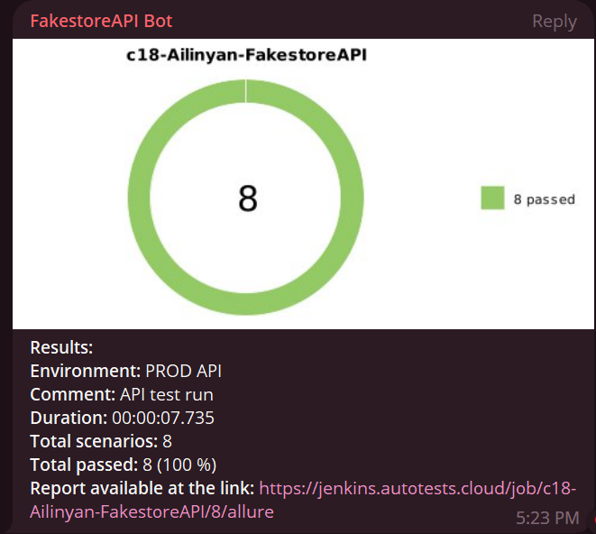

# :crystal_ball: Automated tests for Fakestore API
<p align="center">
</p>

## :page_with_curl:	Contents
+ [Test cases run](#runner-test-cases-run)
+ [Instruments used](#toolbox-instruments-used)
+ [How to run these tests](#compass-how-to-run-these-tests)
  + [Using command prompt](#using-command-prompt)
  + [Using Jenkins](#using-jenkins)
+ [The final report in Allure Reports](#bar_chart-final-report-in-allure-reports)
+ [Allure TestOps integration](#dart-allure-testops-integration)
+ [Test results](#trophy-test-results)

## :runner: Test cases run
### Automated test cases
- CRUD (create, read, update and delete) products tests
  - [x] Correct addition of a new product
  - [x] Get the list of all products in the database
  - [x] Correct updating of a chosen product
  - [x] Correct deletion of a chosen product
- CRUD (create, read, update and delete) cart tests
  - [x] Correct addition of a new cart
  - [x] Get the list of all carts in the database
  - [x] Correct updating of a chosen cart
  - [x] Correct deletion of a chosen cart

# :toolbox: Instruments used
<p  align="center">
  <code></code>
  <code></code>
  <code></code>
  <code></code>
  <code></code>
  <code></code>
  <code></code>
  <code></code>
  <code></code>
<!--   <code></code> -->
  <code></code>

</p>

+ **Java** is the primary programming language for this project.
+ **REST Assured** framework was used for writing the automated tests.
+ **JUnit 5** is used as a unit testing framework.
+ **Gradle** is used to build the project.
+ **Jenkins** is used for running the tests.
+ **Allure Report** is used to visualize test results.
+ **Telegram API** is used for receiving the final report via Telegram Bot.


# :compass: How to run these tests

### Using command prompt

To run the automated tests:
```bash
gradle clean test
```
To get the report:
```bash
allure serve build/allure-results
```

### Using [Jenkins](https://jenkins.autotests.cloud/job/c18-Ailinyan-FakestoreAPI/)


To run this test through Jenkins, please use this [job](https://jenkins.autotests.cloud/job/c18-Ailinyan-FakestoreAPI/), specially created for this project.
The environment is set up for the Russian language, to run it please use the button with an :arrow_forward:.
You can see the results via Allure Reports, or use the link to Allure TestOps.

<p  align="center">

</p>


# :bar_chart: <a name="AllureReports">Final report in [Allure Reports](https://jenkins.autotests.cloud/job/c18-Ailinyan-MiniProject15/)</a>

#### Overview
The main page of the Allure report contains the following information blocks:

>- <code><strong>*ALLURE REPORT*</strong></code> - displays the following info for the given run:
>>- Date and time;
>>- The total number of cases in the given run;
>>- A pie chart indicating the percentage and number of test results: successful, failed, or broken.
>- <code><strong>*TREND*</strong></code> - a line chart that displays the trend of passing tests from build to build
>- <code><strong>*SUITES*</strong></code> - displays the distribution of test results across test suites
>- <code><strong>*CATEGORIES*</strong></code> - displays the distribution of failed tests sorted by defect types
<p align="center">
  
</p>

### List of tests with a description of steps and visualization of results
This page presents the standard distribution of the tests run by user stories and test suites.

<p align="center">
  
</p>


# :dart: [Allure TestOps](https://allure.autotests.cloud/project/2481/) integration

> [AllureTestOps project link](https://allure.autotests.cloud/project/2481) (access request: admin@qa.guru)

### The main dashboard
<p align="center">
  
</p>

### All test cases
<p align="center">
  
</p>

### Launches
<p align="center">
  
</p>

### Launch details
<p align="center">
  
</p>


# :trophy: Test results

### Example of a report of an autotest

<p align="center">
  
</p>

### Attached request information example

<p align="center">
  
</p>

### Attached request information example

<p align="center">
  
</p>

### Telegram notification example
<p align="center">

</p>